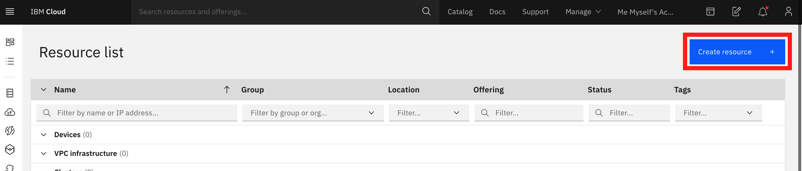

# Cloud Environment Setup

## Get a free IBM Cloud account

To follow along with the workshop start by signing up for a free Cloud account. Click on the below link and fill in the form. You will receive a verification code by email, so please use a real address. 



Once your account is verified and set up, you will see this welcome screen. Click on the 🍔  in the top left corner to expand the contents list. At the top you can find more information about your account, documentation and available resources and services.

Click on the blue button to start adding the resources needed in the workshop.

## Create Resources

### Watson Studio

You should now see this screen where you can find all available resources:

Search for **Watson Studio** and click on the tile. Now select the region **Dallas** and click **Create**. You can leave all other options as the default - Free Lite plan and default name that you can see when scrolling down. 

Watson Studio is now ready, but you will need a few other resources as well. Click on **Resource list** to go back:

From the _Resource list_ click on **Create resource** in the top right to add the next one:

### Object Storage

Select _Services_ and _Storage_ from the menu on the left and search for the **Object Storage**. Click on the tile:

As before use the defaults to create this service in the next screen and then go back to the **Resource list** by clicking first on the 🍔  in the top left corner to expand the contents list:

### Machine Learning

Click on **Create resource** from the Resource list, and now search for **Machine Learning** and click on the tile. Select the region **Dallas** and click **Create**. Leave all other options as the default - Free Lite plan and default name that you can see when scrolling down. 

Go back to the **Resource list**.

### Watson OpenScale

The last resource to add! Click on **Create resource** from the Resource list, and now search for **OpenScale** and click on the tile. Select the region **Dallas** and click **Create**. Leave all other options as the default - Free Lite plan and default name that you can see when scrolling down. 

In the Resource list you should now have 3 **Services** and 1 **Storage**:

## Next

In the Resources list click on **Watson Studio** and then on **Get Started** in the next screen:

This will open a new Tab in your browser. You are now ready to follow along with the hands-on workshop in Watson Studio! 

