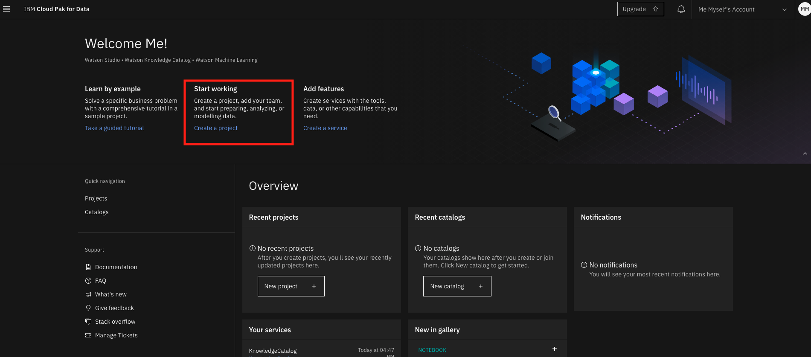
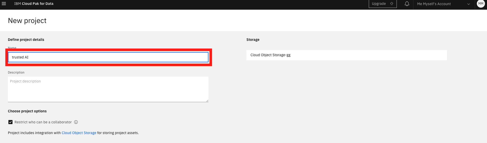
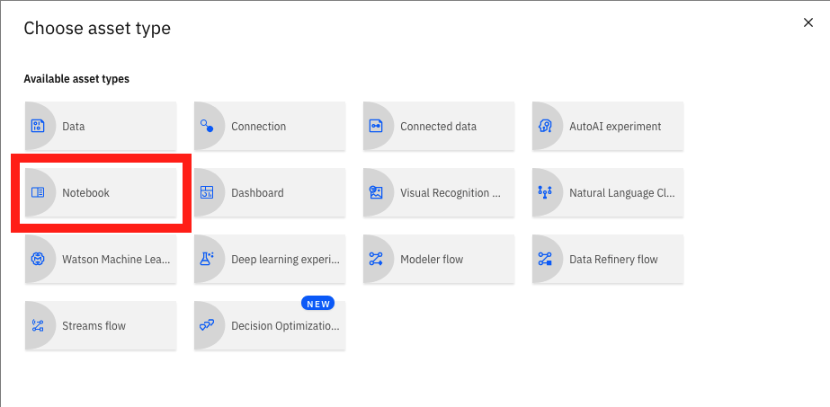
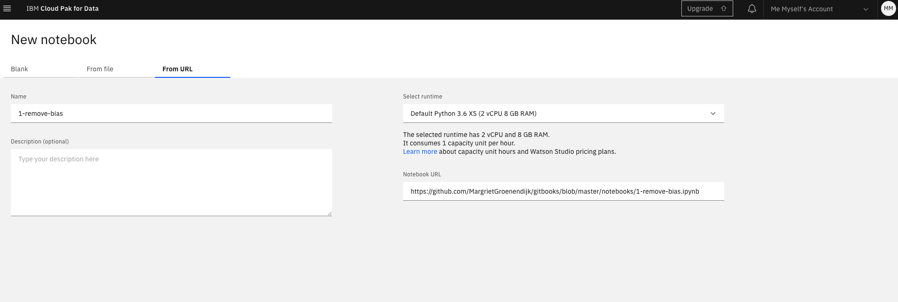
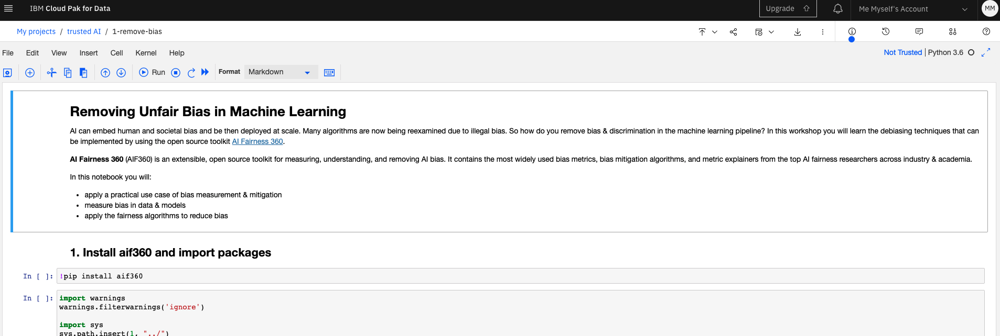
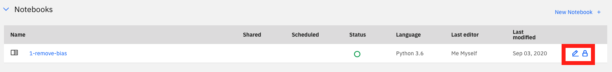

# Part 1: Remove Unfair Bias in Machine Learning

AI can embed human and societal bias and be then deployed at scale. Many algorithms are now being reexamined due to illegal bias. So how do you remove bias & discrimination in the machine learning pipeline? In this part  you will learn about some of the debiasing techniques that can be implemented by using the open source toolkit [AI Fairness 360](https://aif360.mybluemix.net/).

AI Fairness 360 \([AIF360](https://github.com/Trusted-AI/AIF360)\) is a toolkit for measuring, understanding, and removing AI bias. It contains the most widely used bias metrics, bias mitigation algorithms, and metric explainers from the top AI fairness researchers across industry & academia.

You will learn:

* how to measure bias in your data sets & models
* how to apply the fairness algorithms to reduce bias
* how to apply a practical use case of bias measurement & mitigation

## IBM Cloud Pak for Data


If you have not done so yet, go to the [Introduction](https://margriet-groenendijk.gitbook.io/trusted-ai-workshop/introduction) and set up your free IBM Cloud account and follow the instructions to provision the services needed for this workshop.


After going through the cloud environment setup you should now see the below screen in a new browser tab:


You might have noticed the name [_**IBM Cloud Pak for Data**_](https://www.ibm.com/uk-en/products/cloud-pak-for-data) at the top of the below screen instead of Watson Studio. This is the new name of the platform and includes Watson Studio, Watson Knowledge Catalog and Watson Machine Learning. This version runs in the IBM Cloud as-a-service \(aaS\) and now consistent with the Cloud Paks that you can install and run on any other cloud, both private and public, and is powered by [Openshift](https://www.openshift.com/).


## Jupyter notebooks in Watson Studio

Let's start by setting up a project where you can store data, notebooks and many other assets. 

Within the project we will use Jupyter notebooks that allow you to create and share documents containing live code, equations, visualisations and explanatory text. We will be using a number of notebooks in Watson Studio throughout this workshop. These notebooks are contained in a project that you will import into your Watson Studio instance.

### Create a project

Click on **Start working** to create a project that will contain all the assets for this workshop:

In the next screen click on **Create an empty project**. Then give your new project a name and click on Create in the bottom right:

Your previously created Object Storage should be added automatically as above. But it is possible you have to select it from a drop-down menu first.

**Welcome to your new project!** Here you can store notebooks, data and much more. You can also add collaborators, schedule jobs and customise runtime environments. 

Click on **Add to project** at the top right and you will see the below menu with a list of all assets you can add. Click on **Notebook** to add one.

This will bring you here, where you can create a new notebook, add one from a local file or from a URL:

To load the first notebook for this workshop, select **From URL**, give the notebook a name, paste the below link in the Notebook URL field and then click the Create button at the bottom right. You can leave the runtime as the default. 

`https://github.com/MargrietGroenendijk/gitbooks/blob/master/notebooks/1-remove-bias.ipynb`

### Running a notebook

Now a kernel is being spun up and the notebook loaded:

Run each cell in order by selecting it, and then clicking the ▶︎ Run button at the top or use **Shift-Enter**. 

The notebook explores bias in a credit dataset. Find the original data [here](https://archive.ics.uci.edu/ml/datasets/Statlog+%28German+Credit+Data%29) and on [Kaggle](https://www.kaggle.com/uciml/german-credit). 

To go back to the notebook later go to the Projects page and assets tab. Here you find the notebook. Click on the name to see the code, or the pencil to edit and run the notebook:

Go to the next part of the workshop after you have explored the notebook.

