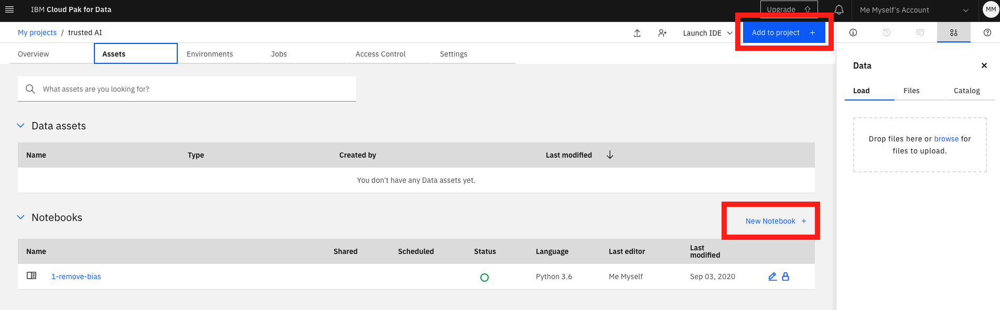

# Part 2: Explain Machine Learning Models

In this part of the workshop you will explore different kinds of explanations suited to different users. As in part 1 we will explore a notebook. 

Go back to the Project page by clicking on the name of the Project at the top of a notebook, or on IBM Cloud Pak for Data and then go to the Project. 

Go to the **Assets** tab and click on **Add to project** or **New Notebook**:

As before, in the next screen select **From URL**, give the notebook a name, paste the below link in the Notebook URL field and then click the Create button at the bottom right. You can leave the runtime as the default. 

`https://github.com/MargrietGroenendijk/gitbooks/blob/master/notebooks/2-explain-models.ipynb`

A kernel is being spun up and the notebook loaded. Run each cell in order by selecting it, and then clicking the ▶︎ Run button at the top or use **Shift-Enter**. 

Go to the next part of the workshop after you have explored the notebook.

