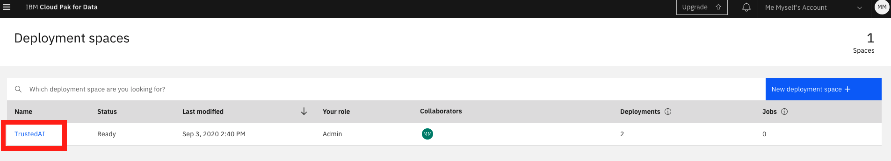
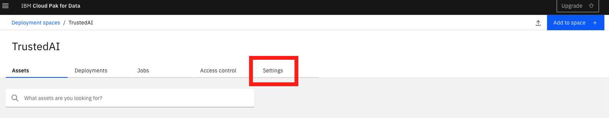

# Part 3: Build a machine learning model and monitor the performance, bias and drift

Before you can successfully run the last notebook, an API key and deployment space need to be set up. Follow the below instructions for this.

## IBM Cloud API key

To deploy a model to Watson Machine Learning and then monitor this model on Watson OpenScale an IBM Cloud API is needed. This key is associated with your identity and is used to access cloud platform and classic infrastructure APIs.

Go to the **Manage** menu at the top of the IBM Cloud page and click on **Access \(IAM\)**:

In the next page, click on **API keys** from the menu on the left. Now click on **Create an IBM Cloud API key**:

Give the API a name, e.g. _**trustedAI**_ and click **Create.** Now copy or download the key, as you will not be able to see it again. This key is needed in the last notebook of the workshop.

## Deployment Spaces

Next set up a deployment space where the model will be deployed. Go to [deployment spaces](https://dataplatform.cloud.ibm.com/ml-runtime/spaces?context=cpdaas) from the menu on the left:

Click on **New deployment space**:

Click on **Create an Empty Space**. 

In the below screen, give the space a name and select a storage service and machine learning service. Then click **Create**:

Click on the new space:

And go to the Settings:

Here you find the **Space ID**. Copy this ID, as it is also needed in the notebook to deploy the model. 

## Load and run the notebook

Now go back to your project in **Watson Studio**.

Go to the **Assets** tab and click on **Add to project** or **New Notebook**:

As before, in the next screen select **From URL**, give the notebook a name, paste the below link in the Notebook URL field and then click the Create button at the bottom right. You can leave the runtime as the default. 

`https://github.com/MargrietGroenendijk/gitbooks/blob/master/notebooks/3-xxx-xx.ipynb`

A kernel is being spun up and the notebook loaded. Run each cell in order by selecting it, and then clicking the ▶︎ Run button at the top or use **Shift-Enter**. 

## Watson OpenScale

After successfully running all cells in the above notebook you should now have a model deployed that is monitored in OpenScale. 

Go to [OpenScale](https://aiopenscale.cloud.ibm.com/) to explore the dashboards. 

